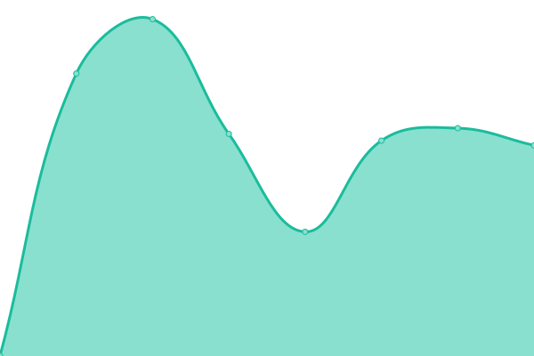
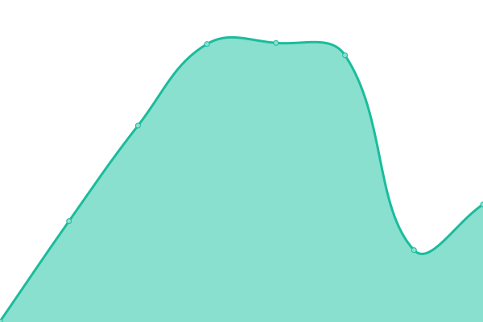
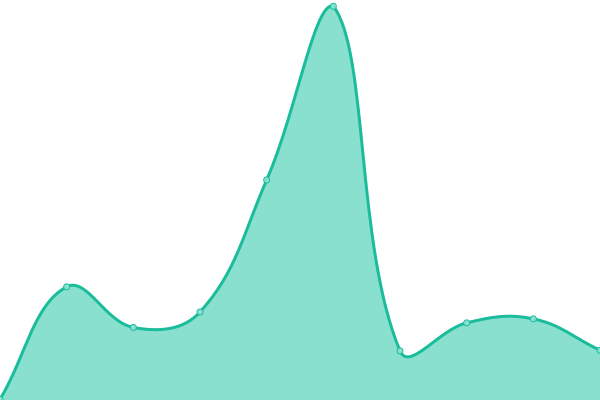
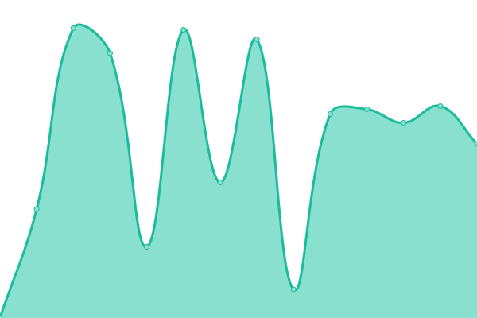

# [📈 Live Status](https://ramonheras.github.io/upptime): <!--live status--> **🟧 Partial outage**

This repository contains the open-source uptime monitor and status page for [Ramon Heras](https://ramonheras.github.io/upptime), powered by [Upptime](https://github.com/upptime/upptime).

With [Upptime](https://upptime.js.org), you can get your own unlimited and free uptime monitor and status page, powered entirely by a GitHub repository. We use [Issues](https://github.com/ramonheras/upptime/issues) as incident reports, [Actions](https://github.com/ramonheras/upptime/actions) as uptime monitors, and [Pages](https://ramonheras.github.io/upptime) for the status page.

<!--start: status pages-->
<!-- This summary is generated by Upptime (https://github.com/upptime/upptime) -->
<!-- Do not edit this manually, your changes will be overwritten -->
<!-- prettier-ignore -->
| URL | Status | History | Response Time | Uptime |
| --- | ------ | ------- | ------------- | ------ |
|  [Code Server](https://code.ramonheras.com) | 🟩 Up | [code-server.yml](https://github.com/ramonheras/upptime/commits/HEAD/history/code-server.yml) | 

 605ms
     
 | 

<a href="https://status.ramonheras.com/history/code-server">100.00%</a>
    

|  [Blog](https://ramonheras.com) | 🟩 Up | [blog.yml](https://github.com/ramonheras/upptime/commits/HEAD/history/blog.yml) | 

 147ms
     
 | 

<a href="https://status.ramonheras.com/history/blog">0.00%</a>
    

|  [Test Notification](https://google.com) | 🟩 Up | [test-notification.yml](https://github.com/ramonheras/upptime/commits/HEAD/history/test-notification.yml) | 

 527ms
     
 | 

<a href="https://status.ramonheras.com/history/test-notification">100.00%</a>
    

|  [Brico AI - 17labs.ai](https://bricoai.17labs.ai) | 🟥 Down | [brico-ai-17labs-ai.yml](https://github.com/ramonheras/upptime/commits/HEAD/history/brico-ai-17labs-ai.yml) | 

 514ms
     
 | 

<a href="https://status.ramonheras.com/history/brico-ai-17labs-ai">18.06%</a>
    

<!--end: status pages-->

[**Visit our status website →**](https://ramonheras.github.io/upptime)

## 📄 License

- Powered by: [Upptime](https://github.com/upptime/upptime)
- Code: [MIT](./LICENSE) © [Ramon Heras](https://ramonheras.github.io/upptime)
- Data in the `./history` directory: [Open Database License](https://opendatacommons.org/licenses/odbl/1-0/)
